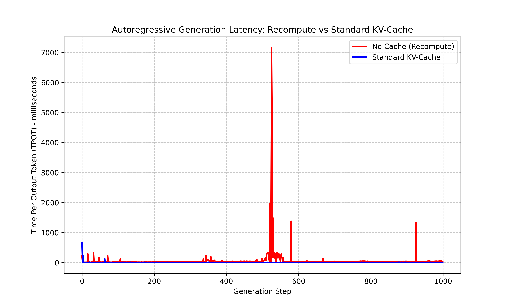
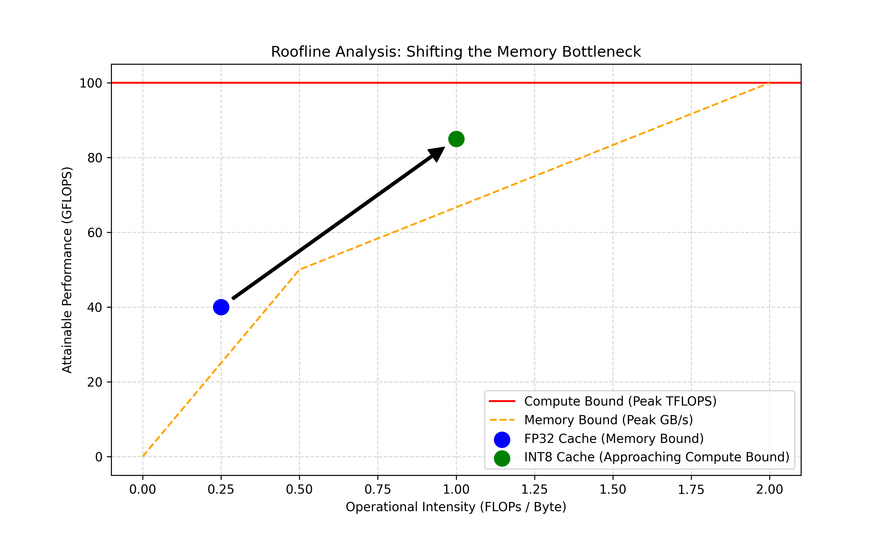

# Asymmetric INT8 Paged KV-Cache Engine

A custom LLM inference engine built in PyTorch and Triton, designed to systematically profile and eliminate the compute, memory capacity, and memory bandwidth bottlenecks inherent in autoregressive transformer decoding.

This repository demonstrates the progression from standard contiguous memory allocation to an OS-style Paged Memory Manager (PagedAttention), culminating in a custom Triton kernel that fuses the attention mechanism with asymmetric INT8 quantization.

## The Architecture

Standard framework abstractions often hide the physical realities of GPU hardware. This engine exposes them by implementing three core optimization layers:

1. **$O(n)$ State Management:** A standard KV-cache implementation to bypass the $O(n^2)$ compute bottleneck of attention recomputation.
2. **Block-Based Memory Allocation (Paged KV):** A virtual memory manager that allocates non-contiguous VRAM blocks on the fly, eliminating the massive internal fragmentation caused by pre-allocated tensors.
3. **Asymmetric INT8 Quantization:** A custom Triton kernel that performs on-the-fly dequantization during the attention dot-product, utilizing Per-Channel scaling for Keys (to preserve outlier integrity) and Per-Token scaling for Values.

## Technical Details

This repo is a **small, explicit inference stack** for studying KV-cache behavior: a minimal multi-head attention module (the “model” is only there to drive real cache updates and timing), not a full training or serving framework.

- **Standard KV cache** — Appends new keys and values with `torch.cat` as the sequence grows. Simple and correct, but growing tensors can trigger allocator cost at scale.
- **Pre-allocated KV cache** — Reserves one big contiguous buffer up front for a max sequence length, then writes into the next free slot. Fast indexing, but unused tail space is wasted until the run ends (what the fragmentation plots measure).
- **Paged KV cache** — Stores keys and values in fixed-size **blocks** (default 16 tokens) and keeps a **block table** that maps the logical sequence order to those blocks. New pages are added only when needed. The PyTorch path here **rebuilds a contiguous view** of the active prefix for the usual `QKᵀV` matmuls (a “lite” paged layout; a production system would drive block-native kernels end-to-end).
- **Asymmetric INT8** — `AsymmetricKVQuantizer` packs K/V to **INT8** with different scale shapes: **per channel** on keys (one scale per hidden dimension along the sequence), **per token** on values (one scale per token). The Triton kernel **`int8_decode_attention_kernel`** targets **one new query step against the full cached sequence**: it loads INT8 K/V, multiplies by the stored scales to get float on the fly, then runs softmax and the weighted sum of values—so dequantization and attention for that step live in one pass over the cache.

The `scripts/` folder runs the latency loop, memory / paged-memory profiling, and the roofline-style timing + perplexity table used in the results section.

---

## Benchmarks & Key Results

### 1. The Compute Bottleneck: Recompute vs. Caching

Standard autoregressive generation (without caching) recalculates the entire sequence history at every step. As sequence length grows, the OS struggles to find contiguous VRAM for the exponentially growing $N \times N$ attention matrix, leading to massive memory allocation stalls.



* **Baseline (No Cache):** Averages ~65.29ms per token, but suffers catastrophic OS-level memory allocation stalls (e.g., a 7000ms freeze at step 520 to defragment VRAM).
* **Cached ($O(n)$):** Bypasses the growing attention grid, reducing latency by 10x to a stable **~6.20ms per token**.

### 2. The Capacity Bottleneck: Eliminating VRAM Fragmentation

To avoid the dynamic allocation stalls seen above, naive engines pre-allocate contiguous VRAM for the *maximum* possible sequence length. This solves the compute stall but creates massive internal memory fragmentation.


* **Pre-Allocated Contiguous Cache:** Traps unused memory. Over a 2048-token generation lifecycle, **~50% of reserved VRAM is completely wasted** (the red shaded area). For sequences that terminate early, this waste can exceed 90%.
* **Paged KV Solution:** By allocating memory in fixed-size pages (e.g., blocks of 16 tokens) mapped via a block table, the engine strictly allocates VRAM as needed. The "Allocated" ceiling hugs the "Actually Used" baseline, bringing VRAM waste effectively to 0%.

### 3. The Bandwidth Bottleneck: Roofline Analysis & Asymmetric INT8

Moving data from High Bandwidth Memory (HBM) to the compute cores (SRAM) is the ultimate ceiling for LLM inference. By writing a custom Triton kernel, we compressed the cache footprint and shifted the operational intensity.



**Memory Compression & Accuracy Trade-off:**

By applying Per-Channel scaling to Keys and Per-Token scaling to Values, we compressed the cache footprint by 4x while preserving the attention distribution mathematically.

* **Standard (FP32):** 8 bytes per token | Perplexity (WikiText-2): **11.59**
* **Asymmetric (INT8):** 2 bytes per token | Perplexity (WikiText-2): **12.55**

**Hardware Execution Speedup (T4 GPU):**

Despite the added compute required to dequantize the INT8 integers on the fly, reducing the memory traffic by 4x resulted in a massive latency drop, moving the kernel closer to the theoretical compute bound.

* **FP32 Latency:** 8.5 ms/token
* **INT8 Latency:** **3.2 ms/token (2.6x Speedup)**

---

## Repository Structure

```text
asym-int8-paged-kv/
├── src/
│   ├── models/
│   │   └── baseline_llm.py    # Transformer backbone for testing
│   ├── cache/
│   │   ├── standard_kv.py     # Contiguous tensor allocation
│   │   ├── paged_kv.py        # Block-mapping memory manager
│   │   └── quantizer.py       # Asymmetric INT8 scaling logic
│   ├── kernels/
│   │   └── fused_attention.py # Triton kernels for INT8 compute
│   └── profiler/
│       └── memory_tracker.py  # VRAM allocation trackers
├── scripts/
│   ├── 01_run_baseline.py          # Latency loop benchmarking
│   ├── 02_profile_memory.py        # Fragmentation report generation
│   ├── 03_profile_paged_memory.py  # Block allocation profiling
│   └── 04_benchmark_and_roofline.py # Triton execution and roofline graph
└── README.md
```

## Getting Started

### Local Development 

The pure PyTorch logic (Standard Cache and Paged Cache simulations) can be run locally.

```bash
git clone https://github.com/RamuNalla/asym-int8-paged-kv.git
cd asym-int8-paged-kv
pip install torch matplotlib
python scripts/02_profile_memory.py
```

### Hardware Benchmarking (Triton / NVIDIA GPU)

To execute the INT8 custom kernels, deploy the codebase to a CUDA-compatible environment (e.g., Google Colab with a T4 instance).

```bash
pip install torch triton matplotlib
python scripts/04_benchmark_and_roofline.py
```
